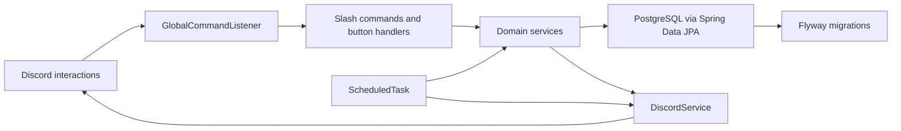

[![logo_png_url]][repo_url]
---
[](https://opensource.org/licenses/Apache-2.0)
[](https://codecov.io/gh/havlli/EventPilot)
[](https://www.codefactor.io/repository/github/havlli/eventpilot)
[](https://github.com/havlli/EventPilot/actions/workflows/test-coverage.yml)
[](https://github.com/havlli/EventPilot/actions/workflows/docker-publish.yml)

EventPilot is a Discord bot for gaming communities that organize scheduled group activities: raids,
dungeons, scrims, static groups, and recurring sessions. Organizers create role-based signup posts,
players claim or change roles with Discord buttons, and the bot keeps capacity, waitlists, lifecycle
state, reminders, and cleanup backed by PostgreSQL.

This repository started as a Java and reactive-programming learning project. It is now being shaped
as a portfolio-ready backend project with a concrete target audience, a Discord-first product flow,
reactive Discord event handling, transactional domain logic, Flyway migrations, and Docker-backed
integration tests.

## Contents

- [Use Case](#use-case)
- [Feature Set](#feature-set)
- [Demo Flow](#demo-flow)
- [Commands](#commands)
- [Signup Rules](#signup-rules)
- [Architecture](#architecture)
- [Supporting Docs](#supporting-docs)
- [Technology Stack](#technology-stack)
- [Local Setup](#local-setup)
- [Configuration](#configuration)
- [Testing](#testing)
- [Discord Bot Setup](#discord-bot-setup)
- [Project Status](#project-status)
- [License](#license)

## Use Case

EventPilot is built for gaming groups where signups need more structure than a plain Discord thread.
The primary user is a raid leader, guild officer, party organizer, or community moderator who needs
to know:

- who is confirmed for an event
- which role each player selected
- whether the group is full
- who is waiting for a slot
- who marked themselves absent, late, or tentative
- whether an event is open, closed, cancelled, or expired

The bot is intentionally centered on Discord messages and buttons. The REST/admin API exists for
supporting operations, but the main product surface is the Discord server.

## Feature Set

- Guided event creation through `/create-event`.
- Reusable role layouts through `/create-embed-type`.
- Button-based role signups using the stable custom ID format `{eventMessageId},{roleIndex}`.
- Transactional signup handling from the database as source of truth.
- Capacity enforcement for confirmed positive-role participants.
- Waitlists for full events.
- Existing participants can change roles without creating duplicate signup records.
- Non-capacity states such as Absence, Late, and Tentative do not fill roster capacity.
- Event lifecycle commands for close, reopen, cancel, delete, and expired cleanup.
- Scheduled reminders before event start time with roster and waitlist summary.
- Expired event deactivation and stale database cleanup.
- Flyway-managed PostgreSQL schema with constraints for participant consistency.
- Unit and integration tests, including Testcontainers-backed PostgreSQL and Redis coverage.

## Demo Flow

This is the recommended walkthrough for a portfolio demo or local smoke test.

1. Invite the bot to a Discord test server.
2. Start the app with Docker Compose or local Maven.
3. Run `/create-embed-type` and create a layout such as:

```text
Tank
Healer
Melee
Ranged
Support
Late
Tentative
Absence
```

4. Run `/create-event` and create a raid/session with a small capacity, for example `2`.
5. Sign up from two Discord users or test accounts until the event reaches capacity.
6. Sign up another user to show waitlist behavior.
7. Change an existing confirmed user to `Absence` and show the next waitlisted user promoted.
8. Run `/close-event`, then try another signup to show lifecycle protection.
9. Run `/reopen-event` and show signups working again.
10. Reduce `DISCORD_REMINDER_LEAD_MINUTES` in a local demo environment and create a near-future event
    to show the reminder embed.
11. Run `/cancel-event` or `/delete-event` to show organizer controls and cleanup.

Useful screenshots or GIFs for a portfolio page:

- event creation prompt flow
- signup embed with role buttons
- full event with waitlist
- reminder embed
- close/reopen/cancel command behavior
- passing `mvn verify` output

## Commands

| Command | Purpose |
| --- | --- |
| `/create-event` | Starts a private guided flow for creating a role-based event signup post. |
| `/create-embed-type` | Creates a reusable role layout for event buttons and embed grouping. |
| `/close-event message-id:<id>` | Closes an event to prevent further signups without deleting the post. |
| `/reopen-event message-id:<id>` | Reopens a previously closed event. |
| `/cancel-event message-id:<id>` | Cancels an event without deleting its historical signup state. |
| `/delete-event message-id:<id>` | Deletes a bot-owned Discord event message and removes matching database state. |
| `/clear-expired` | Deactivates expired event signups in the current channel. |

The `message-id` is the Discord message ID of the event signup post. Event embeds also show the event
ID so organizers can copy it when using lifecycle commands.

## Signup Rules

- The database event is the source of truth for every signup mutation.
- Each Discord user can have only one participant row per event.
- Positive role indexes count toward capacity. Negative role indexes are treated as non-capacity
  states such as Absence, Late, or Tentative.
- New positive-role signups are confirmed while capacity is available.
- New positive-role signups become waitlisted when the event is full.
- Existing confirmed participants can change positive roles even when the event is full.
- Existing non-capacity participants who switch into a positive role are waitlisted when the event is
  full.
- When a confirmed positive-role participant moves to a non-capacity role or is removed, the earliest
  waitlisted positive-role participant is promoted.
- Closed, cancelled, and expired events reject signup button clicks with an ephemeral Discord
  response.

## Architecture



Key implementation points:

- Discord button handling is centralized through one global `ButtonInteractionEvent` path.
- Signup mutation lives in `EventSignupService`, which makes capacity and waitlist behavior testable.
- Repository lookups use locking where concurrent signup consistency matters.
- Scheduled work handles expired-event deactivation and reminder dispatch.
- Discord message rendering is separated into generator/formatter classes.
- Flyway migrations own schema evolution; test schema mirrors the migrated model.

## Supporting Docs

- [Architecture decisions](docs/architecture-decisions.md) explains the signup, waitlist, lifecycle,
  reminder, cleanup, and testing decisions behind the current design.
- [Demo capture guide](docs/demo-capture.md) provides a repeatable script for recording portfolio
  screenshots or GIFs in a Discord test server.

## Technology Stack

- Java 17
- Spring Boot 4
- Project Reactor
- Discord4J
- Spring Data JPA
- PostgreSQL
- Flyway
- Redis
- Spring Security and JWT
- JUnit 5
- Mockito
- Reactor Test
- Testcontainers
- Docker Compose
- Buildpacks

## Local Setup

### Prerequisites

- Java 17
- Maven 3.9+
- Docker
- A Discord bot token

The repository includes `.mise.toml` for local Java and Maven version management.

```shell
mise install
```

### Run With Docker Compose

The root [docker-compose.yml](docker-compose.yml) starts the bot, PostgreSQL, and Redis.

```shell
cp .env.example .env
openssl rand -base64 32
docker compose up -d
```

Before starting, edit `.env` and set at least:

- `DISCORD_BOT_TOKEN`
- `JWT_SECRET`
- `POSTGRES_DB`
- `POSTGRES_USER`
- `POSTGRES_PASSWORD`

After startup, the bot registers slash commands and appears online in Discord servers where it has
been invited.

### Run The App Locally

Start only PostgreSQL and Redis:

```shell
docker compose -f src/main/resources/docker-compose-services.yml up -d
```

Then run the application from source:

```shell
mvn -ntp -Dmaven.repo.local=.m2/repository spring-boot:run
```

## Configuration

| Variable | Required | Default | Purpose |
| --- | --- | --- | --- |
| `DISCORD_BOT_TOKEN` | yes | none | Discord bot token. |
| `JWT_SECRET` | yes | none | Base64-encoded JWT signing secret. Use `openssl rand -base64 32`. |
| `POSTGRES_DB` | yes for Docker | `eventpilot` in local service compose | PostgreSQL database name. |
| `POSTGRES_USER` | yes for Docker | `eventpilot` in local service compose | PostgreSQL username. |
| `POSTGRES_PASSWORD` | yes for Docker | `eventpilot` in local service compose | PostgreSQL password. |
| `SPRING_DATASOURCE_URL` | no | local PostgreSQL URL | JDBC URL override. |
| `SPRING_DATASOURCE_USERNAME` | no | `POSTGRES_USER` | Datasource username override. |
| `SPRING_DATASOURCE_PASSWORD` | no | `POSTGRES_PASSWORD` | Datasource password override. |
| `SPRING_DATA_REDIS_HOST` | no | `localhost` | Redis host. |
| `SPRING_DATA_REDIS_PORT` | no | `6379` | Redis port. |
| `DISCORD_SCHEDULER_INTERVAL_SECONDS` | no | `60` | Scheduled job polling interval. |
| `DISCORD_REMINDER_LEAD_MINUTES` | no | `60` | How long before event start the reminder is sent. |
| `CORS_ALLOWED_ORIGINS` | no | local frontend origins | Allowed origins for REST/admin API calls. |

## Testing

Run the unit test suite:

```shell
mvn -ntp -Dmaven.repo.local=.m2/repository test
```

Run the full verification suite, including Testcontainers integration tests:

```shell
mvn -ntp -Dmaven.repo.local=.m2/repository verify
```

`verify` requires Docker. The integration suite starts PostgreSQL and Redis containers and validates
repository behavior, migrations, application startup, and API journeys.

The current hardening pass has been verified locally with:

- warning-enabled test compilation
- full unit test suite
- full Maven `verify`
- `git diff --check`

## Discord Bot Setup

### Get A Bot Token

1. Open the [Discord Developer Portal](https://discord.com/developers/).
2. Create or select an application.
3. Open the **Bot** tab.
4. Reset and copy the token.
5. Store it in `.env` as `DISCORD_BOT_TOKEN`.

Treat the token as a secret. Do not commit it.

### Invite The Bot

1. Open the application in the Discord Developer Portal.
2. Go to **OAuth2** and then **URL Generator**.
3. Select the `bot` and `applications.commands` scopes.
4. Select permissions needed for your test server. For a quick private demo, Administrator is the
   simplest option. For a tighter setup, grant message, slash command, channel, and event-related
   permissions explicitly.
5. Open the generated URL and authorize the bot into your server.

## Project Status

Completed hardening areas:

- global signup interaction handling
- transactional signup service
- capacity and duplicate-user safeguards
- waitlists and waitlist promotion
- event lifecycle states
- stale event cleanup
- scheduled reminders
- Docker/Testcontainers verification

Useful next improvements:

- capture the demo screenshots or GIFs from the scripted guide
- add CI workflow documentation and badge cleanup if needed
- decide whether the REST/admin API is a supported product surface or legacy support tooling
- add production deployment notes for hosting, secrets, logs, and backups

## License

This project is licensed under the Apache License 2.0. See [LICENSE.txt](LICENSE.txt).

<!-- Repository -->

[repo_url]: https://github.com/havlli/EventPilot

[logo_png_url]: https://raw.githubusercontent.com/havlli/EventPilot/main/public/logo-300px.png

[logo_svg_url]: https://raw.githubusercontent.com/havlli/EventPilot/main/public/logo.svg
